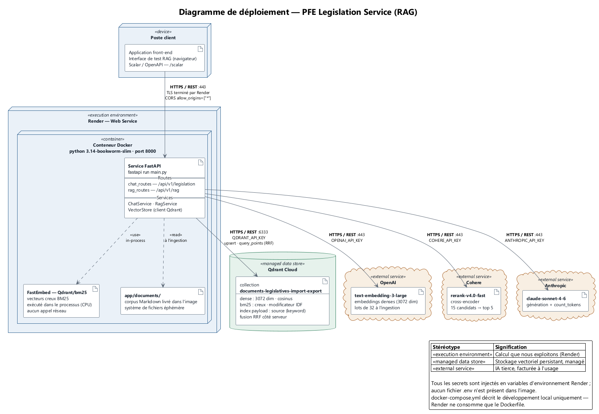

# Documentation du RAG (Retrieval augmented generation)

## Qu'est ce qu'un RAG?

Retrieval-Augmented Generation (RAG) est une architecture (ou technique) qui améliore la capacité d'un LLM (Large language model) en le connectant à une source de connaissance externe (base de données, documents, APIs, etc). Au lieu de se baser uniquement sur l'information que le LLM a été entrainé dessus, le modèle récupère les éléments pertinents et mis à jour de ces sources et l'intègrent dans le processus de génération. Cela permet à un LLM de produire une réponse plus précise, mis à jour, et spécifique à un domaine sans la nécéssité de l'entrainer.

## Problèmes que le RAG vient résoudre dans le cadre de notre projet?

L'objectif du RAG dans ce projet est d'accélérer la recherche de réglementations concernant un produit spécifique et les pays partenaires d'importation ou d'exportation. Sans cette technologie, les membres du CAPD devraient effectuer manuellement des recherches préalables à travers des milliers de pages réparties dans de multiples documents, puis alimenter la base de données. Grâce au RAG et aux modèles structurés Pydantic, nous pouvons en revanche demander à l'IA d'extraire les informations nécessaires sous une forme structurée ; cela permet de les traiter directement et d'alimenter la base de données via un flux entièrement automatisé.

## Les 2 phases du RAG

RAG est divisé en deux phases importantes et complémentaire. La phase d'ingestion des données est le processus dont les sources d'informations sont transformés et stocké dans la base de données vectorielle. La phase de retrieval est le processus dont on récupère les meilleurs extraits d'informations et pertinent pour générer une réponse.

### Phase Ingestion (aussi appelé 'indexing pipeline')

La phase d'ingestion transforme les sources de données brutes en vecteurs interrogeables, stockés dans la base de données vectorielle. Elle se déroule en plusieurs étapes séquentielles:

1. **Sources** collecte des données brutes depuis les différentes sources d'information. Celles-ci peuvent être sous plusieurs formes comme: PDF, HTML, texte brute, etc. Dans le cadre de ce projet, les sources sont des documents legislatives sur le domaine d'import et export de la marchandise en format PDF.
2. **Transformation des documents** cette étape transforme les documents dans un format plus compatible avec RAG (dans le cas de ce projet, il s'agit du format Markdown). La transformation des documents en format markdown est faite à l'aide d'un LLM. Parcontre, un autre très bonne option gratuit est la librairie Docling qui est capable de transformer n'importe quel type de source d'information (meme un site web) en markdown.
3. **Découpage (chunking)** les documents sont découpés en segments de taille raisonnable (chunks), afin de respecter la limite de contexte des modèles d'embedding et de garder chaque extrait suffisamment précis et autonome pour être pertinent lors du retrieval. L'algorithme utilisé pour le processus de découpage basé sur la strcutrue du document ([voir l'algorithme de découpage](#algorithme-de-découpage---découpage-basé-sur-la-structure-du-document))
4. **Embeddings** chaque chunk est transformé en **deux représentations vectorielles complémentaires**, générées en parallèle:
    - **Vecteur dense**: le modèle d'embedding utilisé est le 'text-embedding-3-large' de OpenAI qui crée des vecteurs de dimension de 3072. Un vecteur dense capture le sens sémantique du chunk dans un espace continu de quelques centaines à quelques miliers de dimensions.
    - **Vecteur sparse**: produit par une méthode comme BM25 ou SPLADE qui capture la présence et l'importance des mots-clés spécifiques du chunk dans un espace de très haute dimensionnalité, dizaine de miliers (majoritairement des zéros).
5. **Stockage** les deux vecteurs (dense et sparse) sont stockés comme deux vecteurs nommés sur le **même point** dans Qdrant. Cela évite de dupliquer les chunks et permet, plus tard, d'effectuer une recherche hybride (voir section [Recherche hybride](#hybrid-search)).

Cette double vectorisation à l'ingestion est ce qui rend possible, côté retrieval, la combinaison entre recherche sémantique (dense) et recherche par mots-clés (sparse) — chacune compensant les angles morts de l'autre (voir _Dense vector_, _Sparse search_, _Hybrid search_ plus bas).

#### Algorithme de découpage - découpage basé sur la structure du document

Découpage basé sur la structure découpe un document selon des sections au lieu d'un nombre de charactères fixe. Si une section dépasse la taille limit d'un chunk, l'algorithme va diviser la section en plusieurs sections en gardant le titre pour chacun. Cet algorithme est utilisé parce que les documents legislativs suivent une hiérarchie par sections qui intègre des structures strictes tels que des tableaux.

### Phases Retrieval - trois étapes

#### Retrieval - techniques/stratégies

Ce sont des techniques ou des stratégies qui améliorent la qualité du 'retrieval' des extraits d'informations de la base de données vectorielle. Le 'Retrieval' est une étape très importante pour générer la bonne réponse à l'utilisateur parce que les extraits de textes sont ensuite jumelés avec le prompt initiale de l'utilisateur pour créer un prompt final à envoyer à un LLM. Si ces extraits de texte ne sont pas précis, la réponse du LLM ne le sera pas non plus. Les models de embeddings (transformation du text en représentaiton numérique) se situent dans trois catégories: Dense vector (Embeddings), Sparse vector (BM25 ou Keyword), et Hybrid (combinaison des deux)

##### Dense vector

Utilisé pour la compréhension et recherche sémantique.

Chaque chunk est transformé par un modèle d'embedding (text-embedding-3-large de OpenAI) en un vecteur 3072 dimensions. La requête de l'utilisateur est transformée de la même façon, puis on calcule la similarité cosinus entre le vecteur de la requête et les vecteurs des chunks stockés dans Qdrant pour retrouver les plus proches sémantiquement. Cette approche capte bien les reformulations et synonymes, mais peut manquer des correspondances exactes sur des termes rares, des codes d'erreur ou des noms précis.

##### Sparse Vector

Utilisé pour la compréhension et recherche de mots clés

Chaque chunk est transformé en un vecteur de très haute dimensionnalité (une dimension par mot du vocabulaire), majoritairement composé de zéros. Les méthodes courantes sont BM25 (pondération classique par fréquence de termes) et SPLADE (une version apprise et enrichie). La correspondance entre la requête et un chunk se fait par recoupement des dimensions actives (mots communs), et non par proximité géométrique comme pour les vecteurs denses. Cette approche est précise sur les termes exacts, mais ne capte pas les synonymes ou reformulations.

##### Hybrid search

Combine les deux approches précédentes: la requête est envoyée en parallèle à la recherche dense et à la recherche sparse, chacune retournant sa propre liste de résultats classés. Ces deux listes sont ensuite fusionnées en un seul classement, généralement avec la méthode **Reciprocal Rank Fusion (RRF)**, qui combine les résultats en fonction de leur position dans chaque liste plutôt que leurs scores bruts (les scores cosinus et BM25 ne sont pas sur la même échelle et ne peuvent pas être comparés directement). Qdrant supporte nativement RRF via son `query_points` API, en combinant des `Prefetch` sur les vecteurs denses et sparse d'une même collection.

#### Reranking

Après que les meilleurs candidats ont été récupéré par la recherche hybride, ils passent par un processus de réorganisation. Ce processus utilise un cross-encoder (rerank-v4.0-fast de Cohere) qui prend les pairs <prompt, candidat> pour les encoder **conjointement**. Cela permet de calculer un score de pertinence beaucoup plus précis, puisque le modèle compare directement le contenu de la requête et du candidat plutôt que de mesurer une simple distance géométrique entre deux vecteurs pré-calculés. Le but est de réordonner la liste pour que quand on prend les top 5 candidats, on est sûr qu'ils incluent les chunks pertinents.

## Diagrames

### Diagramme déploiement

Ce diagramme a pour but de présenter les differents services impliqués dans ce projet et les intéractions entre eux.

## Les coûts associés

Les coûts du système se répartissent en deux familles distinctes:

1. **Les coûts d'hébergement (infrastructure)**, qui sont fixes et récurrents à chaque mois, peu importe le volume d'utilisation.
2. **Les coûts d'inférence des modèles d'IA**, qui sont variables et proportionnels à l'usage réel (nombre de documents ingérés, nombre de questions posées).

### Coûts d'hébergement

L'ensemble des composants du système est hébergé sur Render, à l'exception de la base vectorielle qui utilise l'offre gratuite de Qdrant Cloud.

| Composant | Hébergement | Coût mensuel |
| --- | --- | --- |
| Service RAG (FastAPI) | Render | 7 $ |
| Base de données relationnelle (PostgreSQL) | Render Basic 1 Go | 19 $ |
| Base de données vectorielle (Qdrant) | Qdrant Cloud (free tier) | Gratuit |
| **Total** | | **26 $ / mois** |

### Évaluation des coûts services externe vs open source

Une décision d'architecture importante a été de déterminer si les modèles d'embedding et de reranking devaient être opérés en interne (modèles open source servis par Ollama) ou consommés via des services externes (OpenAI et Cohere). Les deux approches ont été évaluées sur la base du coût total de possession.

#### Coûts d'utilisation des services externe

Les services externes sont facturés à l'usage, sans coût fixe. Aucune ressource de calcul n'a besoin d'être provisionnée ni maintenue.

| Service | Rôle dans le pipeline | Tarif |
| --- | --- | --- |
| OpenAI `text-embedding-3-large` | Vectorisation dense (ingestion et requêtes) | 0,13 $ / 1 M tokens |
| Cohere `rerank-v4.0-fast` | Reranking des candidats | 2,00 $ / 1 000 recherches |
| Claude Sonnet 4.6 | Génération de la réponse finale | 3 $ / 1 M tokens en entrée, 15 $ / 1 M tokens en sortie |
| BM25 (fastembed, exécuté localement) | Vectorisation sparse | Gratuit |

#### Coûts de déploiment et infra pour open source (Ollama)

Servir soi même les modèles élimine la facturation à l'usage, mais impose de provisionner une machine capable de les faire tourner. Le tableau ci dessous compare les options d'hébergement pour le modèle d'embedding `qwen3-embedding`, dans ses deux tailles.

| Modèle | Render (CPU seulement, aucune option GPU) | Azure, VM CPU | Azure, VM GPU |
| --- | --- | --- | --- |
| `qwen3-embedding:0.6b` (~639 Mo) | Standard: 25 $/mois (2 Go RAM, 1 CPU). Le palier Starter (7 $/mois, 512 Mo) est insuffisant une fois ajoutée la surcharge du runtime d'Ollama. | D2s_v5: environ 70 à 90 $/mois (2 vCPU, 8 Go RAM), largement surdimensionné pour un modèle 0.6b. | Non pertinent: le modèle 0.6b tourne convenablement sur CPU. |
| `qwen3-embedding:4b` (~2,5 Go) | Pro Plus: 175 $/mois (8 Go RAM, 4 CPU) recommandé pour avoir de la marge. L'inférence CPU reste nettement plus lente au moment de la requête. | D2s_v5: environ 70 à 90 $/mois (8 Go RAM), fonctionnel mais limité par le CPU, avec une latence comparable au palier Pro Plus de Render. | NC4as_T4_v3: environ 384 $/mois (GPU T4), nécessaire pour obtenir une latence d'embedding acceptable en temps réel. |

Le reranking en interne pose une contrainte supplémentaire. Le modèle `BAAI/bge-reranker-v2-m3` pèse 2,3 Go et se heurte à deux limites sur l'infrastructure actuelle:

1. **Absence de GPU (CUDA)**, indispensable pour accélérer le passage du cross encoder sur les candidats et garder une latence acceptable.
2. **Mémoire vive**, le modèle exigeant une quantité de RAM que les paliers d'hébergement économiques ne fournissent pas.

À noter que le passage des vecteurs denses vers OpenAI a fortement allégé l'empreinte du service RAG: la recherche hybride fonctionne désormais sans difficulté sur le CPU de base de Render, alors que l'approche entièrement locale demandait auparavant de 7 à 8 Go de RAM. Le reranker demeure le seul composant qui justifierait encore une machine dédiée.

#### Verdict

L'approche par services externes a été retenue. Le coût d'inférence réel du système se situe autour de quelques dollars par mois pour un volume d'utilisation typique, alors que la plus économique des configurations open source viables ajouterait au minimum 25 $ par mois de coût fixe, et davantage encore dès qu'un GPU devient nécessaire pour le reranker. Le point de bascule financier ne serait atteint qu'à un volume de requêtes très supérieur à celui du projet, et il faudrait de surcroît absorber le coût d'exploitation de l'infrastructure. Les services externes offrent également une qualité de modèle supérieure, une latence stable et aucune maintenance.

### Phase ingestion complet

Le pipeline d'ingestion complet prend environ 3 minutes et 13 secondes et n'est exécuté que deux fois par mois, la législation évoluant peu fréquemment.

| Métrique | Valeur |
| --- | --- |
| Chunks total dans Qdrant | 4 311 |
| Tokens d'embedding total | 347 596 |
| Moyenne de tokens par chunk | 80,6 |

Coût d'un cycle d'ingestion complet: 347 596 tokens × 0,13 $ / 1 M ≈ **0,045 $**, soit environ **0,09 $ par mois** pour les deux exécutions. La vectorisation sparse (BM25) est calculée localement et n'engendre aucun coût.

### Prompt + réponse

Coût d'une question suivie de sa réponse, mesuré sur le premier endpoint.

| Composante | Quantité | Coût |
| --- | --- | --- |
| Embedding du prompt (OpenAI) | 21 tokens | 0,000003 $ |
| Reranking (Cohere) | 1 unité de recherche | 0,0020 $ |
| Génération, entrée (Claude) | 2 368 tokens × 3 $ / 1 M | 0,000308 $ |
| Génération, sortie (Claude) | 196 tokens × 15 $ / 1 M | 0,00294 $ |
| **Total** | | **0,005251 $** |

Une requête complète revient donc à environ un demi cent. Le reranking (0,0020 $) et la génération en sortie (0,00294 $) représentent à eux seuls plus de 94 % du coût, tandis que l'embedding du prompt est négligeable.

Il faut souligner que les coûts unitaires décroissent de façon exponentielle inverse avec le volume: la portion fixe de l'ingestion est amortie sur l'ensemble des requêtes, si bien que le coût moyen par question tend vers le coût marginal d'inférence à mesure que l'utilisation augmente. À titre indicatif, pour 1 000 questions par mois, le coût total du système s'établit autour de 33 $ d'hébergement plus 5,34 $ d'inférence, soit environ **38 $ par mois**.
